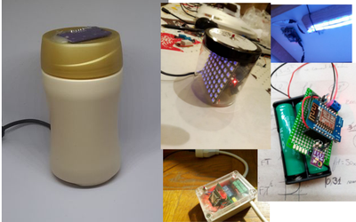
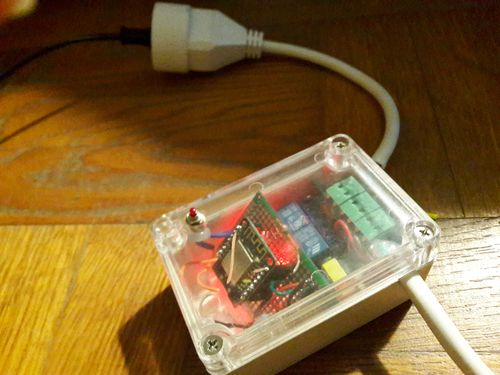
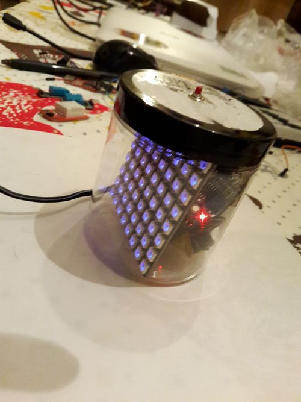
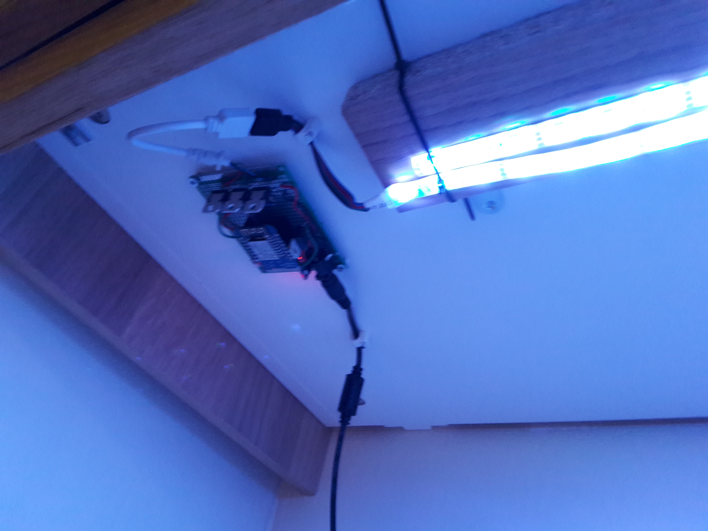
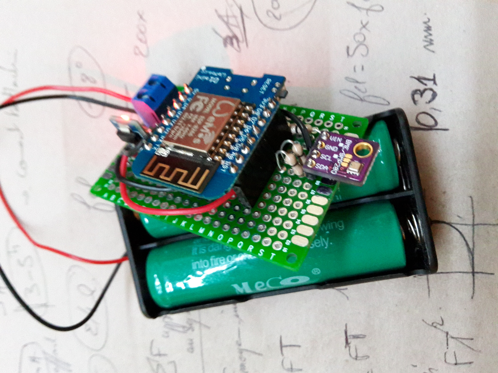

MyNodeIOT
=======

This repository is a collection of tools i used in my home automation.

We used the principle of **#SmartHome** concepts, you can have more informations here : 
[https://github.com/mqtt-smarthome/mqtt-smarthome](https://github.com/mqtt-smarthome/mqtt-smarthome)

**Build your own HomeMade - Hacked Wifi MQTT devices**

This project provide examples, and implementation to setup NodeMCU units , based on [ESP8266](https://fr.wikipedia.org/wiki/ESP8266) ,  linked to a [MQTT broker](http://mqtt.org/).

**ESP8266** is a quite nice and cheap piece for setting up this solution, for less that 3$ you have an embedded microcontroller for handling the bridge between the software and physical world.

If you have a bit time and knowledges, for a very cheap cost but time, you can setup your own home automation, monitoring or "Computer Managed Home Experience"

Using Lua save time in setup and development, and reduce the needed knowledge.

## ChangeLog

* 2020 - update to NodeMCU v3

# Project Features

- NodeMCU lua Stacks for creating IOT [MQTT](http://mqtt.org/) / [ESP8266](https://fr.wikipedia.org/wiki/ESP8266) device
- Providing Some examples objects for creating new sensors or actuators. Currently the following are demonstrated:
  - Switch
  - DHT11 temperature sensor
  - Relays
  - ADC input
  - Body Sensor detector
  - WifiLocation (providing informations on the indoor location of the device)
  - LED matrix display based on WS2812 embedded controller
  - RGB Led strips (PWM controlled)

# Deployment

This is much simple on the physical side, only a RPI, and devices.

Minimum Software Installed :

	RPI : 
		Linux weezy (debian) - RPI
		Mosquitto (MQTT broker)
		Controlling agents using Python or other languages
		NodeRed for handling glueing logic
		
	a Device using this project : 
		NodeMCU - Firmware
		the current Lua scripts, adjusted on the use

additional nodes can be added as a storage node for making queries in a time-framed manner. In some cases dockerised influxdb on an orangepi node, monitoring agents

---

# How this work ?

## General Logical View

System principes are based on the [MQTT](http://mqtt.org/) protocol and Wifi Connection.  [MQTT broker](http://mqtt.org/) collect and distribute the information among the devices, permitting to dissociate sensor, actuators and the usage of them.

here is the big picture (logical view).

MQTT provide fast and lightweight protocol to make it work. IOT objects are implemented as "local plateform" handling either sensors or actuators. Embedded logics can also be hosted in the device.

In a simple implementation, we used a Rasberry PI computer connecter to the ISP box for providing the MQTT broker and private wifi HotSpot.

## Device

Using the Lua NodeMCU stack, the following organization is provided :

---

a common stack implemented in NodeMCU, using lua, implements :

-  sensors and actuator registry
- MQTT message queue
- Connection and restart handling

## Controlling Agents

As the device can be used as either dumb sensors , agents have been implemented to support "high level" decisions.  

Led display control, animations are done using agents implemented in python.

# Software Stuff needed

Installing Mosquitto on RPI linux : [http://jpmens.net/2013/09/01/installing-mosquitto-on-a-raspberry-pi/](http://jpmens.net/2013/09/01/installing-mosquitto-on-a-raspberry-pi/)

# Hardware Stuff needed

## Parts we haved used in project

ESP12 - module : [http://www.banggood.com/ESP8266-ESP-12E-Remote-Serial-Port-WIFI-Transceiver-Wireless-Module-p-980984.html](http://www.banggood.com/ESP8266-ESP-12E-Remote-Serial-Port-WIFI-Transceiver-Wireless-Module-p-980984.html)

FTDI - for sending the program to the chip : [http://www.banggood.com/FT232RL-FTDI-USB-To-TTL-Serial-Converter-Adapter-Module-For-Arduino-p-917226.html](http://www.banggood.com/FT232RL-FTDI-USB-To-TTL-Serial-Converter-Adapter-Module-For-Arduino-p-917226.html)

2 Way Relay Module : [http://www.banggood.com/2-Way-Relay-Module-With-Optocoupler-Protection-p-972428.html](http://www.banggood.com/2-Way-Relay-Module-With-Optocoupler-Protection-p-972428.html)

other passif/actif components, 7803 and 7805 for 5v and 3.3v regulator, 
resistors, condensators

## Before starting :

Before starting you can have more informations on NodeMCU firmware here : 
[http://fr.slideshare.net/geekscape/nodemcu-esp8266-workshop-1](http://fr.slideshare.net/geekscape/nodemcu-esp8266-workshop-1)

# Further readings (links)

[http://www.penninkhof.com/2015/05/linking-the-esp8266-a-raspberry-pi-through-mqtt/](http://www.penninkhof.com/2015/05/linking-the-esp8266-a-raspberry-pi-through-mqtt/)

NodeMCU : [http://nodemcu.com/index_en.html](http://nodemcu.com/index_en.html)

NodeMCU Firmware documentation:
[http://nodemcu.readthedocs.io/](http://nodemcu.readthedocs.io/)

An other article on the same subject (french): [http://www.framboise314.fr/linternet-des-objets-iot-sur-raspberry-pi-avec-mqtt/](http://www.framboise314.fr/linternet-des-objets-iot-sur-raspberry-pi-avec-mqtt/)

# Real World devices made with it

[SimpleDevice 01](hardware/SimpleDevice01/index.md)  - Relay Handling

[SimpleDevice 01 V2](hardware/SimpleDevice01_V2/v2.md)

[SimpleDevice 02](hardware/SimpleDevice02/index.md) - Led screen display device with switch and body sensor

[SimpleDevice 03](hardware/SimpleDevice03/index.md) - Led strip light, with body detector and switch

[SimpleDevice 04](hardware/SimpleDevice04/index.md) - Battery Autonomous Humidity, Pression, Temperature sensor

[SimpleDevice05](hardware/SimpleDevice05/index.md) Led Screen Display

