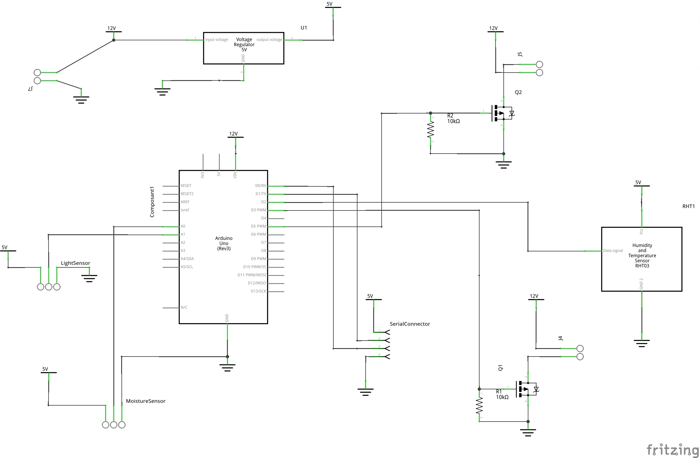

This prototype is an expermiment for adding to the smart home system, some additional capabilities to monitor plants and growing plants. 

# The IOT Growing plant station

The growing plant is hosted in the living room, and permit us to grow seeds before planting them on the outside. The growth rate is about 4 time faster than the outside. There are still ways of improvment but gives good results in preparing and growing aromatic plants or even small vegetables.

The growing station is controlled using MQTT, and associated tools. (either python script for logic, or node red), or standard mqtt dashboard on mobile phones.

	

Additional Datascience tools are used to compute the plant grow rate, but also monitor the timeseries

[Simple Growth Rate computation, using PlantCV](growth_rate_plantcv.pdf)

Sensors and Actuators in the growing station :
- Ambiant light
- Humidity
- Temperature
- Moisture and soil humidity
- Inner light
- Inner water pump control or air renewing
- IOT camera

The Growing station has a lighting system on the top, with pulsed air system. At the initial design, a watering system was planned. 

A camera has been also added, as an independant system, to watch the progress and control the several actuators.

Electronic has been confined on the top inside a small box. And some sensors are watched here as the moisture sensor, humidity and temperature sensor, 

on the top, a small temperature and humidity sensor has been setup to have these values and monitored properties. 

# Electronic

The electronic is based on the Arduino UNO module, that permit to prototype and solvering the whole once tested. Arduino if fine for electric sensor connection and PWM actuator controlling.

Schema are really simple and presented below. Only Supply adaptation, and also Mosfets for Light and Air Control regulation, permitting to have a 12V control.

