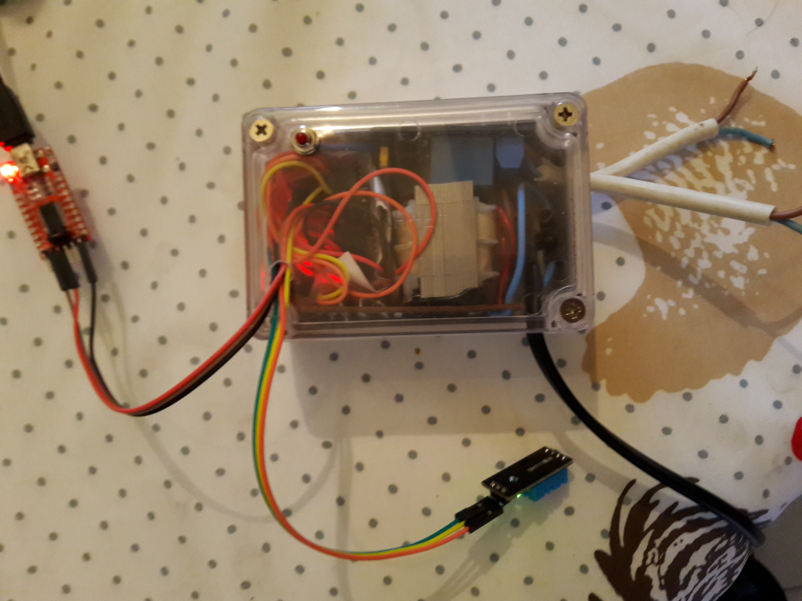

# Device V1

Boitier contenant :

- capteur de température et d'humidité
- 2 commandes de relais
- un interrupteur de communication

ESP12 - DHT 11 - Relais
Etage d'alimentation : 7805 - 5v, module 3,3v bangood

# Pilotage - Branchements de commande sur l'ESP 12

Relai 1 : gpio0
Relai 2 : gpio6
Température DHT11: gpio2

Programmation : TX : brun, RX : Rouge, GND : noir

