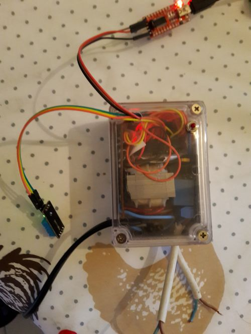

#Prise de note sur l'ESP8266 - ESP12 - V1

Update 12/02 : V2 version reimplementation for better relyability : 

Brochage ESP12:

RESET : pull up 2,2kohm V+
CH_PD : pull up 2,2kohm V+
GPIO15 : GND

Vitesse de connection :

115000 bauds -> peut être perdu en terme de configuration, utiliser 9600 bauds, fonctionne tout le temps !!! 

	AT+GMR

	AT version:0.23.0.0(Apr 24 2015 21:11:01)
	SDK version:1.0.1
	Ai-Thinker Technology Co. Ltd.
	Apr 27 2015 13:55:14
	
	OK

##Flash firmware node MCU

utilisation du logiciel de flash avec les paramètres par défaut

procedure :

- il est important que la broche GPOI0 (noté GPOI6) soit à 0, avec un redémarrage de l'esp
- démarrage de l'esp (alimentation)
- choix du fichier dans le logiciel de firmware
- changement de la taille flash (1mb)
- Appuyez sur flash
- Enlever la broche GPIO0 (en l'air)
- redémarrer l'esp

le courant norminal doit être de 60 ma

##NodeMCU

on peut utiliser alors esplorer pour programmer.
​	
	PORT OPEN 9600

	Communication with MCU...
	Got answer! AutoDetect firmware...
	Communication with MCU established.
	NodeMCU firmware detected.
	=node.heap()
	23152
	> =node.heap()
	23152
	> =node.heap()
	23152
	> =node.heap()
	23152

#Projet réalisé en hardware

Boitier contenant :

- capteur de température et d'humidité
- 2 commandes de relais
- un interrupteur de communication

ESP12 - DHT 11 - Relais
Etage d'alimentation : 7805 - 5v, module 3,3v bangood

#Pilotage - Branchements de commande sur l'ESP 12

Relai 1 : gpio0
Relai 2 : gpio6
Température DHT11: gpio2

Programmation : TX : brun, RX : Rouge, GND : noir

