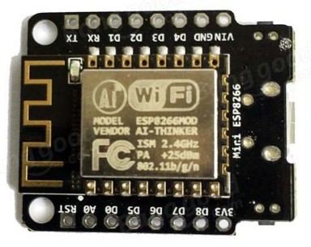
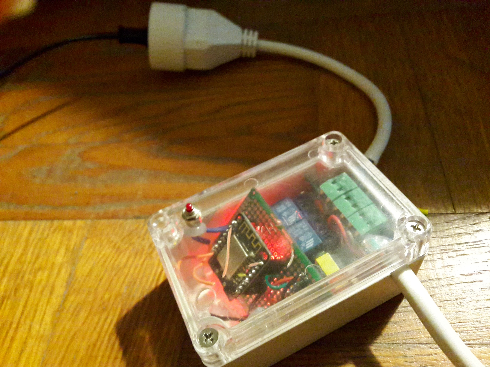
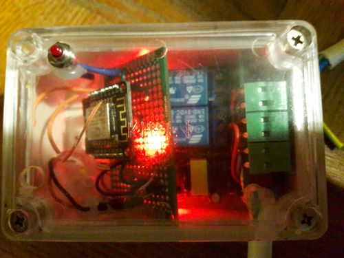

# Simple Device V2

Relay + Wifi Location

instead of wiring the chip, all done with soldering iron. 

instead of using the default esp chip, i reused a simple module, much more simple to use, and only about 2euro more expensive. 

Both test Weemos and China alternative : both works great.

the current picture :

Contains two relay command, and wifi MQTT Access, using the MyMqttIOT dev.

I also added the wifilocation, permitting to know where the module is in the house, using the available STA wifi BSS