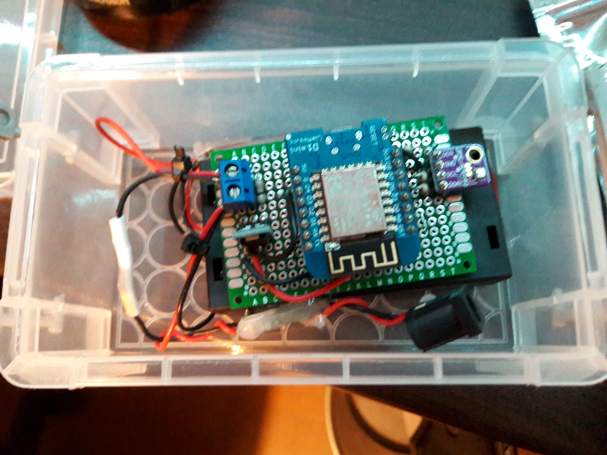
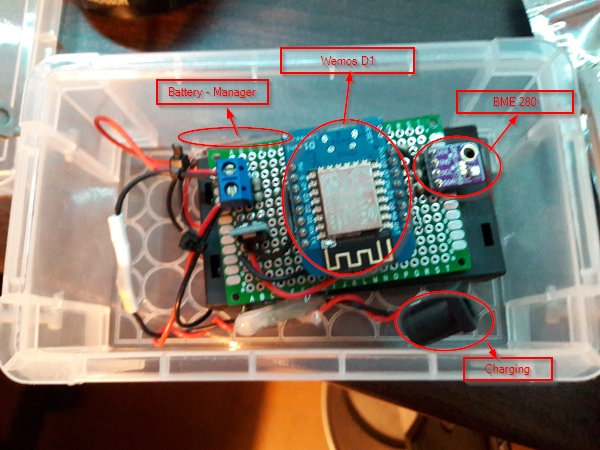

#Precision Temperature / Pression / Humidity sensor

This sensor use the BMP280 chipset to measure Temperature / Pression and Humidity

**Parts :**

- Wemos ESP8266 emmbeded board, 
- [BMP280 I2C Module](https://cdn-shop.adafruit.com/datasheets/BST-BMP280-DS001-11.pdf)
- 3,3 regulator
- 2 lipo 3,7V Batteries - 3000 mAh

The original design device looks like this :

 

##Software components

in this device, we used :

- an ESP 8266 for wifi connection
- the BME/BMP280 module using the myMQTTIoT lua stack

this module is a wrapper to [https://github.com/avaldebe/AQmon](https://github.com/avaldebe/AQmon) BMP 280 module

##Sleep mode

As it is powered by a battery, saving the battery is important, 
we connect the GPIO 16 to RST pin, permitting to deepsleep mode the chip

so we have measures on 20s every 10 mins (initially configured).

Measuring the consumption is about :
70-80 mA in measuring the air
down to 5mA in sleep mode for 10 mins 

battery lifetime is by now about a week.

## Update 12/02/2017

Added a Lithium Ion protection card for avoid crash the battery (if battery is too low, it is destroyed by chemical modifications). Added an external DC - DC converter for charging phase

Latest tests show that using the hibernate mode if ESP 8266, and 15 mins wakeup for 5 measures , the batteries charge life is about 3-4 days.

