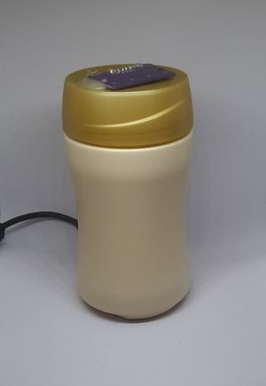
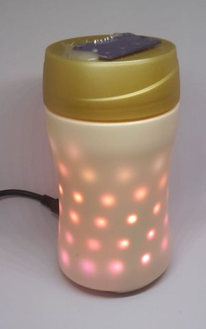
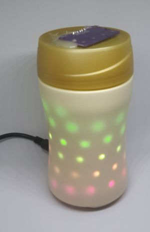
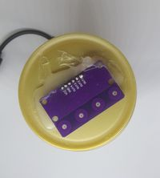

# Led Box

Device that display ambient information about the home automation. 

Led Band controlling permit to animate the display, depending on the feedback

[Dynamic Video Demonstration](https://www.youtube.com/watch?v=edEmEUA4E-M)

[See the mqtt-agent-ledbox repository for more informations for controlling agent (animations, and language)](https://github.com/mqttiotstuff/mqtt-agent-ledbox)

Behave like a screen, using agent to control the display animation and behaviour.

## Contains

- Microwave presence sensor
- 4 touch button on the top
- LedStrip

