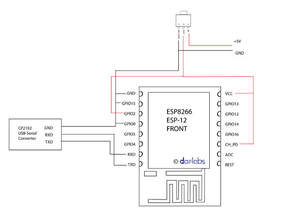
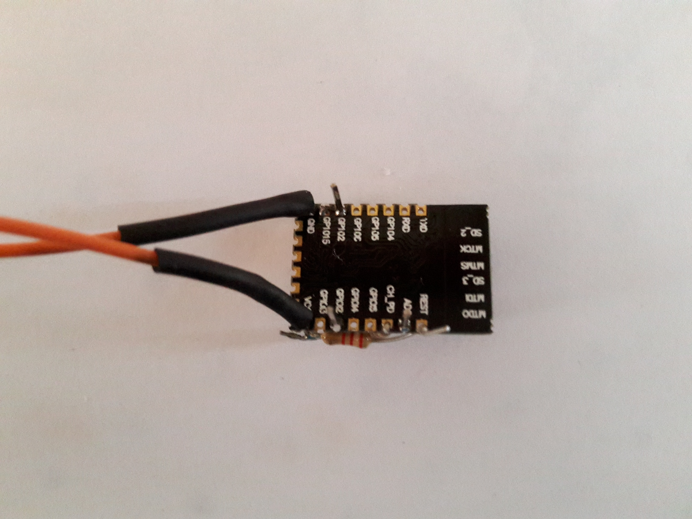
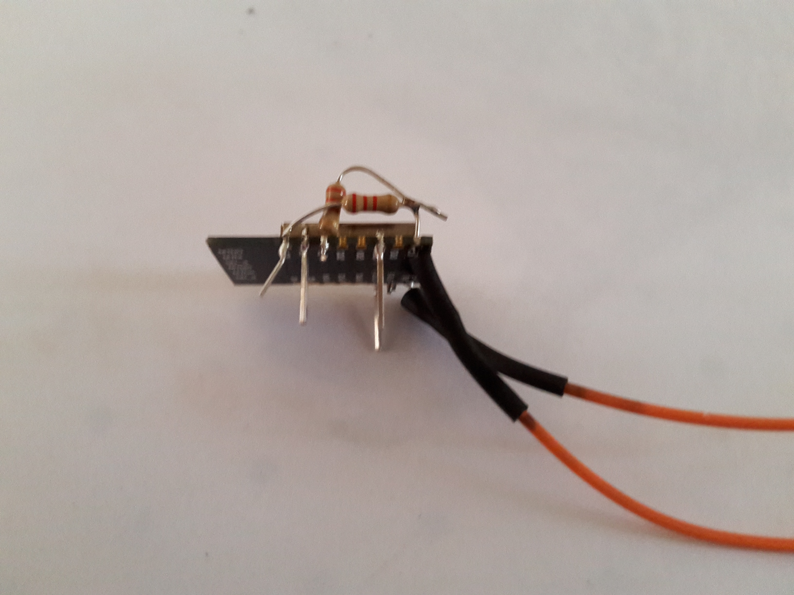
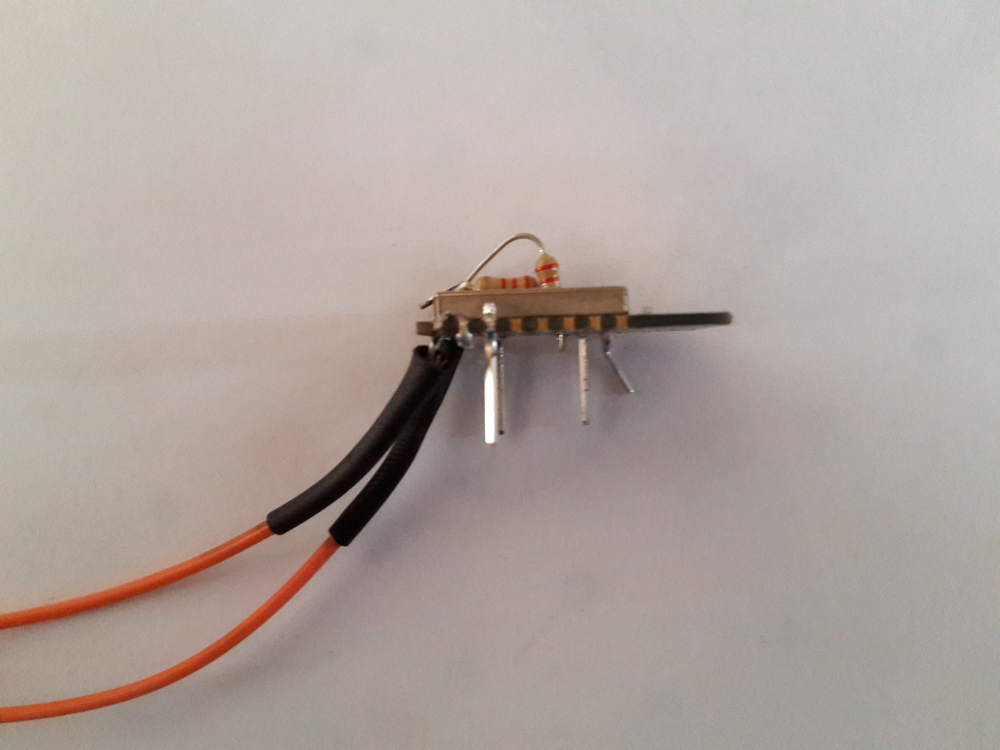

#Simple ESP Wiring

using a rought ESP12 device, you can easily use a couple of welds for using it and flash it.

Device connexion :

in implementation, VCC and GND are connected with two external wires.

adding 2 resistor, directly welds on the board help maintaining the RESET pin

Additional pins can be externalize for GPIO or ADC.

